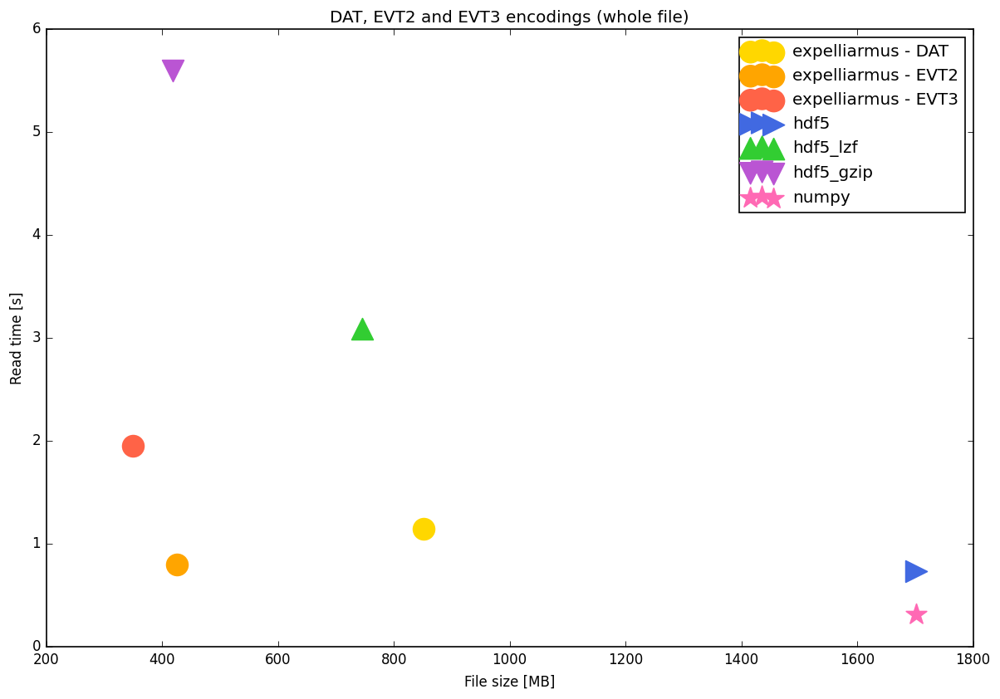
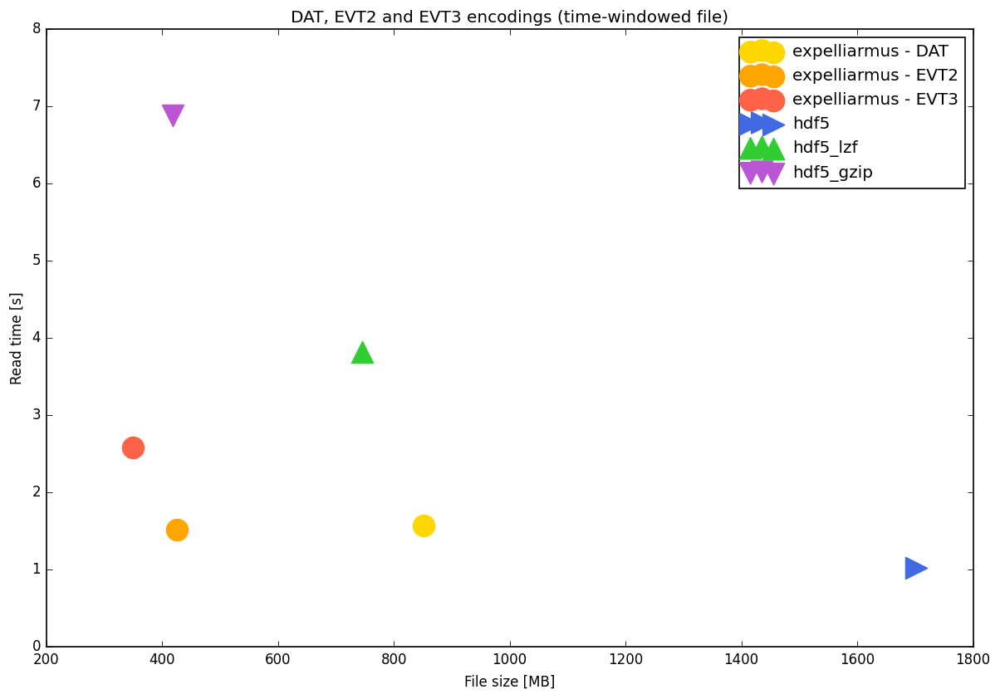
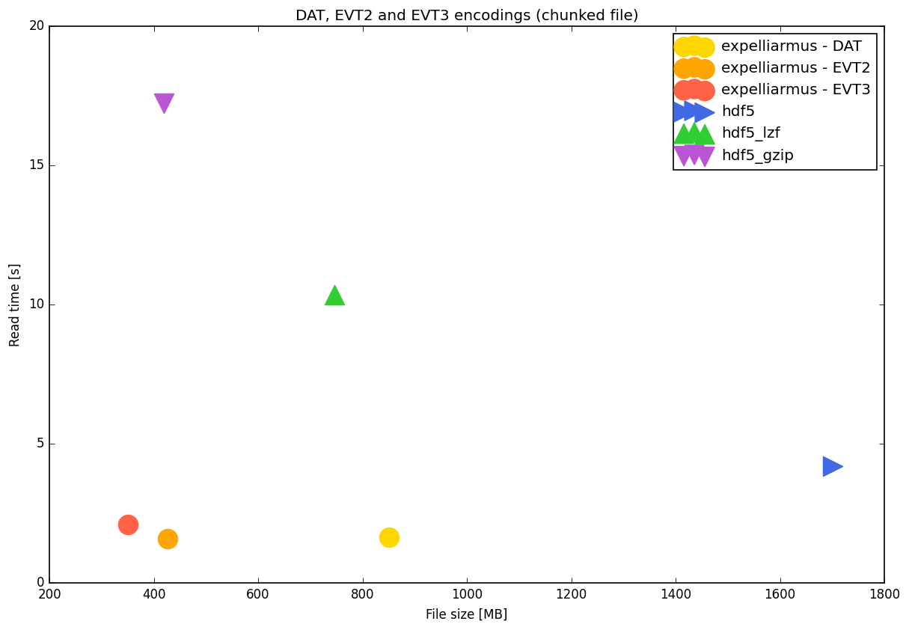

[](https://pypi.org/project/expelliarmus/)
[](https://codecov.io/gh/fabhertz95/expelliarmus)
[](https://github.com/fabhertz95/expelliarmus/pulse)
[](https://expelliarmus.readthedocs.io/en/latest/?badge=latest)
[](https://discord.gg/C9bzWgNmqk)


A Python/C library for decoding DVS binary data formats to NumPy structured arrays.

## Supported formats
- [DAT](https://docs.prophesee.ai/stable/data/file_formats/dat.html)
- [EVT2](https://docs.prophesee.ai/stable/data/encoding_formats/evt2.html)
- [EVT3](https://docs.prophesee.ai/stable/data/encoding_formats/evt3.html)

## Installation 
You can install the library through `pip`:
```bash
pip install expelliarmus 
```

The package is tested on Windows, MacOS and Linux. Join us on [Discord](https://discord.gg/C9bzWgNmqk) to propose features or to signal bugs!

## Documentation

Check out [readthedocs](https://expelliarmus.readthedocs.io)!

## Getting started

`expelliarmus` is a library that allows to decode binary files generated by [Prophesee](https://prophesee.ai) cameras to [NumPy structured arrays](https://numpy.org/doc/stable/user/basics.rec.html). 

The `expelliarmus` API contains a single class called `Wizard`, that contains many methods to read a file all at once, in chunks of `chunk_size` events or in time windows of `time_window` milliseconds. There are also additional methods to save structured NumPy arrays to different Prophesee encoding formats. 

### Read a file

Let us download [this file](https://dataset.prophesee.ai/index.php/s/fB7xvMpE136yakl/download) from the Prophesee website. 


```python
from pathlib import Path
import requests

prophesee_url = "https://dataset.prophesee.ai/index.php/s/fB7xvMpE136yakl/download"
fpath = Path("./pedestrians.raw")

# Downloading the file if it is not available.
if not fpath.is_file():
    print("Downloading the file...", end=" ")
    open(fpath, 'wb').write(requests.get(prophesee_url).content)
    print("done!")
else:
    print("File already available.")
```

    Downloading the file... done!


The file that we downloaded is an EVT3 one; hence, we need to create a `Wizard` object choosing an `"evt3"` encoding.


```python
from expelliarmus import Wizard

wizard = Wizard(encoding="evt3")
```

The file to be read can be specified in three ways:
- passing the `fpath` argument to the `Wizard` constructor at object creation time.
- using the `set_file()` method.
- passing the file path to the `read()` method.

Let us use the second way.


```python
wizard.set_file(fpath)
```

Now we can use the `read()` method to read the binary file to a NumPy structured array. 


```python
arr = wizard.read()
print(f"First event encoded as (t, x, y, p): {arr[0]}")
print(f"Number of events: {len(arr)}.")
print(f"Recording duration: {(arr[-1]['t']-arr[0]['t'])//int(1e6)} s.")
```

    First event encoded as (t, x, y, p): (5840504, 707, 297, 0)
    Number of events: 39297796.
    Recording duration: 60 s.


### Reading in chunks

The file could be too large to be read all at once in an array; for this reason, `expelliarmus` provides two generator methods: `read_chunk()` and `read_time_window()`, to read a file in chunks of a `chunk_size` events or in time windows of `time_window` milliseconds, respectively. Let us start from the first method.


```python
chunk_size = 8192
wizard.set_chunk_size(chunk_size)

# Calling the generator once:
chunk = next(wizard.read_chunk())
print(f"Chunk length: {len(chunk)}.")
print(f"Chunk duration: {(chunk[-1]['t']-chunk[0]['t'])/1e3:.2f} ms.")
print(f"Chunk first event: {chunk[0]}.")
```

    Chunk length: 8192.
    Chunk duration: 154.27 ms.
    Chunk first event: (5840504, 707, 297, 0).


Let us read a chunk of at most `time_window` milliseconds duration from the file:


```python
time_window = 5
wizard.set_time_window(time_window)

# Calling the generator once.
chunk = next(wizard.read_time_window())
print(f"Chunk length: {len(chunk)}.")
print(f"Chunk duration: {(chunk[-1]['t']-chunk[0]['t'])/(1e3):.2f} ms.")
print(f"Chunk first event: {chunk[0]}.")
```

    Chunk length: 47.
    Chunk duration: 4.50 ms.
    Chunk first event: (5840504, 707, 297, 0).


### Conversion among file formats

Suppose that you have a really large file encoded in DAT, like [this one](https://dataset.prophesee.ai/index.php/s/YAri3vpPZHhEZfc/download). You might want to convert it to EVT2 to save disk space and have better read performance. `expelliarmus` allows you to do that. Let us download the file first. 


```python
prophesee_url = "https://dataset.prophesee.ai/index.php/s/YAri3vpPZHhEZfc/download"
fpath = Path("./spinner.dat")

# Downloading the file if it is not available.
if not fpath.is_file():
    print("Downloading the file...", end=" ")
    open(fpath, 'wb').write(requests.get(prophesee_url).content)
    print("done!")
else:
    print("File already available.")
```

    Downloading the file... done!


First we change `wizard` encoding and, then, we read the DAT file to an array.


```python
wizard.set_encoding("dat")
arr = wizard.read(fpath)

print(f"First event encoded as (t, x, y, p): {arr[0]}")
print(f"Number of events: {len(arr)}.")
print(f"Recording duration: {(arr[-1]['t']-arr[0]['t'])/1e6:.2f} s.")
```

    First event encoded as (t, x, y, p): (0, 237, 121, 1)
    Number of events: 54165303.
    Recording duration: 5.00 s.


Now we define a second `Wizard` object with EVT2 encoding and we use its `save()` method to convert the file from DAT to EVT2.


```python
import numpy as np 

wizard_evt2 = Wizard(encoding="evt2")
new_fpath = Path("./spinner_evt2.raw")
wizard_evt2.save(fpath=new_fpath, arr=arr)
```

Let us check that the files are consistent.


```python
new_arr = wizard_evt2.read(new_fpath)

print(f"Durations: DAT = {(arr[-1]['t']-arr[0]['t'])/1e6:.2f} s, \
EVT2 = {(new_arr[-1]['t']-new_arr[0]['t'])/1e6:.2f} s.")

are_equal = True
for coord in ('t', 'x', 'y', 'p'):
    are_equal = are_equal and np.equal(arr[coord], new_arr[coord]).all()

print(f"The two arrays are {'not' if (not are_equal) else ''}identical.")
```

    Durations: DAT = 5.00 s, EVT2 = 5.00 s.
    The two arrays are identical.


There are other methods available in the API. [Check it out!](https://expelliarmus.readthedocs.io/en/latest/autoapi/expelliarmus/index.html)

## A small benchmark

Here it is a small benchmark using `expelliarmus` on the file formats supported. Benchmarking is run on [this file](https://dataset.prophesee.ai/index.php/s/nVcLLdWAnNzrmII/download), converted from EVT3 to DAT and EVT2 using the `save()` method. The data shows the file size, read time for the full file and read time for reading the file in chunks and time windows. The performance is compared against HDF5, HDF5 LZF, HDF5 GZIP and NumPy.



    Full file read
    ------------------------------------------------------------------------------------------------------------
    Software  | Size [MB] | Diff. DAT | Diff. EVT2 | Diff. EVT3 | Time [s] | Diff. DAT | Diff. EVT2 | Diff. EVT3
    ------------------------------------------------------------------------------------------------------------
    exp. DAT  | 851       | -0%       | +100%      | +143%      | 1.15    | -0%       | +43%       | -41%       
    ------------------------------------------------------------------------------------------------------------
    exp. EVT2 | 426       | -50%      | -0%        | +22%       | 0.80    | -30%      | -0%        | -59%       
    ------------------------------------------------------------------------------------------------------------
    exp. EVT3 | 350       | -59%      | -18%       | -0%        | 1.95    | +70%      | +144%      | -0%        
    ------------------------------------------------------------------------------------------------------------
    hdf5      | 1701      | +100%     | +299%      | +386%      | 0.73    | -36%      | -8%        | -62%       
    ------------------------------------------------------------------------------------------------------------
    hdf5_lzf  | 746       | -12%      | +75%       | +113%      | 3.09    | +170%     | +287%      | +58%       
    ------------------------------------------------------------------------------------------------------------
    hdf5_gzip | 419       | -51%      | -2%        | +20%       | 5.60    | +389%     | +600%      | +187%      
    ------------------------------------------------------------------------------------------------------------
    numpy     | 1701      | +100%     | +299%      | +386%      | 0.32    | -72%      | -60%       | -84%       
    ------------------------------------------------------------------------------------------------------------





    Time windowing read
    ------------------------------------------------------------------------------------------------------------
    Software  | Size [MB] | Diff. DAT | Diff. EVT2 | Diff. EVT3 | Time [s] | Diff. DAT | Diff. EVT2 | Diff. EVT3
    ------------------------------------------------------------------------------------------------------------
    exp. DAT  | 851       | -0%       | +100%      | +143%      | 1.58    | -0%       | +4%        | -39%       
    ------------------------------------------------------------------------------------------------------------
    exp. EVT2 | 426       | -50%      | -0%        | +22%       | 1.51    | -4%       | -0%        | -42%       
    ------------------------------------------------------------------------------------------------------------
    exp. EVT3 | 350       | -59%      | -18%       | -0%        | 2.58    | +64%      | +71%       | -0%        
    ------------------------------------------------------------------------------------------------------------
    hdf5      | 1701      | +100%     | +299%      | +386%      | 1.02    | -35%      | -32%       | -60%       
    ------------------------------------------------------------------------------------------------------------
    hdf5_lzf  | 746       | -12%      | +75%       | +113%      | 3.82    | +143%     | +153%      | +48%       
    ------------------------------------------------------------------------------------------------------------
    hdf5_gzip | 419       | -51%      | -2%        | +20%       | 6.88    | +337%     | +355%      | +166%      
    ------------------------------------------------------------------------------------------------------------





    Chunk read
    ------------------------------------------------------------------------------------------------------------
    Software  | Size [MB] | Diff. DAT | Diff. EVT2 | Diff. EVT3 | Time [s] | Diff. DAT | Diff. EVT2 | Diff. EVT3
    ------------------------------------------------------------------------------------------------------------
    exp. DAT  | 851       | -0%       | +100%      | +143%      | 1.64    | -0%       | +3%        | -22%       
    ------------------------------------------------------------------------------------------------------------
    exp. EVT2 | 426       | -50%      | -0%        | +22%       | 1.58    | -3%       | -0%        | -24%       
    ------------------------------------------------------------------------------------------------------------
    exp. EVT3 | 350       | -59%      | -18%       | -0%        | 2.09    | +28%      | +32%       | -0%        
    ------------------------------------------------------------------------------------------------------------
    hdf5      | 1701      | +100%     | +299%      | +386%      | 4.20    | +157%     | +166%      | +101%      
    ------------------------------------------------------------------------------------------------------------
    hdf5_lzf  | 746       | -12%      | +75%       | +113%      | 10.36   | +534%     | +555%      | +395%      
    ------------------------------------------------------------------------------------------------------------
    hdf5_gzip | 419       | -51%      | -2%        | +20%       | 17.23   | +954%     | +989%      | +724%      
    ------------------------------------------------------------------------------------------------------------

## Contributing
Please check our [documentation page](https://expelliarmus.readthedocs.io) for more details on contributing.
